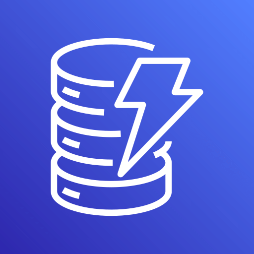

<table>
  <tr>
    <!-- Team logo (left) -->
    <td>
      
    </td>
    <!-- AWS logos (right) -->
    <td>
      
      
      
      
      
      
       
      
    </td>
  </tr>
</table>

# Operation Duloc
Built by University of Florida team "What Are You Doing In My Swamp?"

## Project Overview

### Built with:

### Technologies used:
* Arduino ESP32 BLE library
* TI TivaWare peripheral drivers
* Custom **G8RTOS** kernel (scheduling, semaphores, threads, UART/SPI drivers)

### Architecture

## AWS DynamoDB
* Scalable and relatively easy-to-use database system
* Integrates easily with other AWS services
* Free-form NoSQL format for on-the-fly data format changes

## AWS IoT Core
* Come standard with MQTT publish/subscribe model
* Allow for a centralized staging area for devices

## AWS IoT Rules
* Straightforward data redirection framework
* SQL-based digestion engine for data parsing before redirection
* Forwards to DynamoDB instance
* Forwards to Webserver via HTTP packet for display
* Solid error fallback for diagnostics

## Getting Started

### Installation Instructions

#### ESP32
1. Install the Arduino ESP32 core ([https://github.com/espressif/arduino-esp32](https://github.com/espressif/arduino-esp32)).
2. Open `BLE_to_TIVA_Frames.ino` in the Arduino IDE.
3. For each ESP32 board:

   * Set `OWN_NAME` to `"ESP0"`, `"ESP1"`, or `"ESP2"`.
   * Upload the code.
4. Connect ESP32 TX (GPIO 17 by default) to the Tiva UART RX.
5. Ensure all grounds (ESP32 + Tiva + LCD) share a common ground.

#### Web App UI
See [Swamp Portal README](https://github.com/emma-coronado/Swamp-Portal?tab=readme-ov-file#quick-start)

## License

This project was developed as part of the **Vanderbilt Hackathon submarine swarm project**.

See `LICENSE` file for license information.

## ⭐ Acknowledgments 
**Special thanks to the following teams for joining our collaborative dashboard vision:**
* AutoGators
* Aardvark
* Goblin Gang
* Jet2Holiday
* Clankers
* The Hivemind
* Prober
* One
